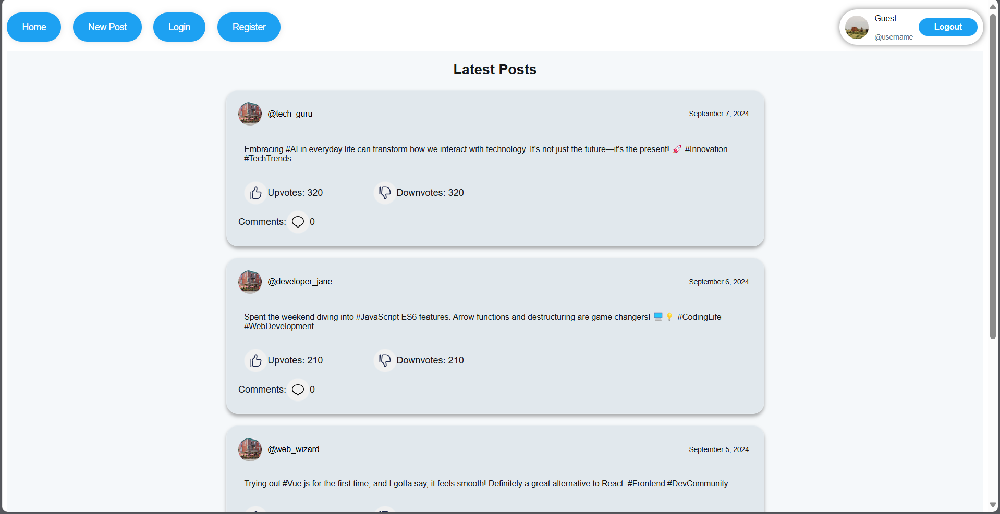
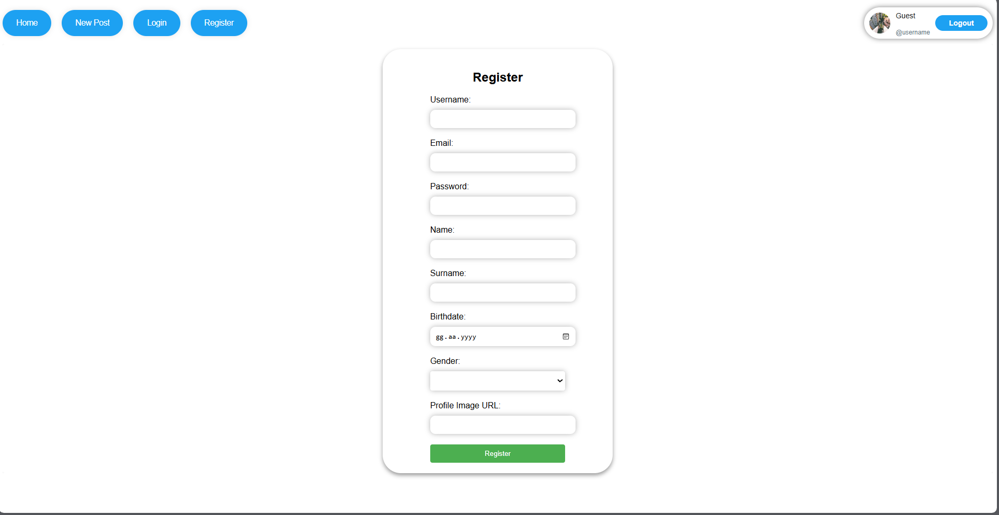
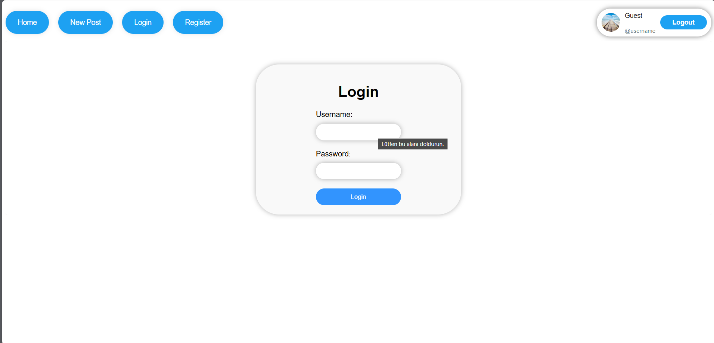
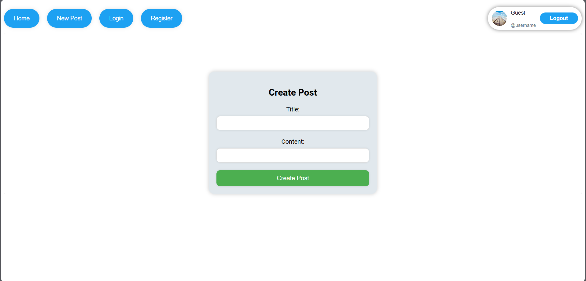

# Campfire Frontend

## Project Overview

Campfire is a modern, responsive social media platform built with Vue.js. It serves as a portfolio piece showcasing contemporary web development practices, including a component-based architecture, dynamic styling with CSS variables for theme management, and a focus on user experience.

This project has been significantly refactored and modernized to reflect a professional code structure and a sleek, X (formerly Twitter)-like aesthetic.

## Features

-   **User Authentication:** Secure login and registration (mock API).
-   **Post Management:** Create, view, and interact with posts.
-   **Dynamic Homepage:** Displays a list of posts with a modern, single-column layout.
-   **Responsive Design:** Optimized for various screen sizes, from mobile to desktop.
-   **Dark/Light Mode:** Seamless theme switching for enhanced user comfort.
-   **Modern UI/UX:** Clean, intuitive interface inspired by leading social media platforms.
-   **Component-Based Styling:** Styles are scoped to individual components for better maintainability and reduced conflicts.

## Screenshots

*(Note: Screenshots below are from the original version. Updated screenshots reflecting the new design will be added soon.)*

### Home Page



### Register Page



### Login Page



### Create Post Page



## Technologies Used

-   **Vue.js 2:** Progressive JavaScript framework.
-   **Vuex:** State management for Vue.js applications.
-   **Vue Router:** Declarative routing for Vue.js.
-   **Axios:** Promise-based HTTP client for the browser and Node.js.
-   **CSS Variables:** For efficient and dynamic theme management (Dark/Light Mode).
-   **Mock API:** For simulating backend interactions during development. The full backend API for this project can be found at: [campfire_microblog-backend](https://github.com/Berkayozgun/campfire_microblog-backend)

## Getting Started

Follow the steps below to run the project on your local machine.

### Prerequisites

-   Node.js (LTS version recommended)
-   npm (Node Package Manager)

### Installation

1.  Clone the repository:

    ```bash
    git clone https://github.com/Berkayozgun/campfire-frontend.git
    ```

2.  Navigate into the project directory:

    ```bash
    cd campfire-frontend
    ```

3.  Install the project dependencies:

    ```bash
    npm install
    ```

### Running the Project

To start the development server and view the application in your browser:

```bash
npm run serve
```

This will typically open the application at `http://localhost:8080` (or another available port).

## Usage

-   **Login:** Use mock credentials (e.g., `username: demoUser`, `password: demo`) to log in.
-   **Register:** Create a new mock account to test the registration process.
-   **Create Post:** Logged-in users can create new posts.
-   **Theme Toggle:** Use the sun/moon icon in the header to switch between Light and Dark modes.

## Modernization & Refactoring Highlights

-   **X-like UI Redesign:** The entire application's user interface has been revamped to align with the modern, minimalist aesthetic of the X platform.
-   **Centralized Style Management:** Transitioned from separate CSS files to component-scoped styles using `<style scoped>` within Vue components, enhancing modularity and reducing global style conflicts.
-   **Dynamic Theming:** Implemented a robust dark/light mode system using CSS variables, allowing for seamless theme switching across the application.
-   **Improved Component Structure:** Refined component logic and template structure for better readability and maintainability.
-   **Dependency Cleanup:** Removed unused libraries (`vue-tailwind`) to optimize project size and performance.

## Future Enhancements (Potential)

-   Integration with a real backend API.
-   Advanced search and filtering for posts.
-   User profile pages.
-   Real-time updates for posts and comments.
-   More comprehensive testing.
